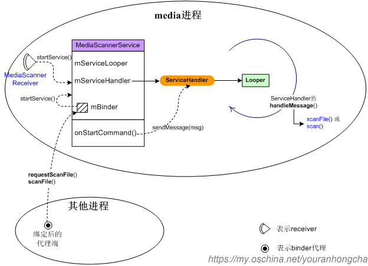
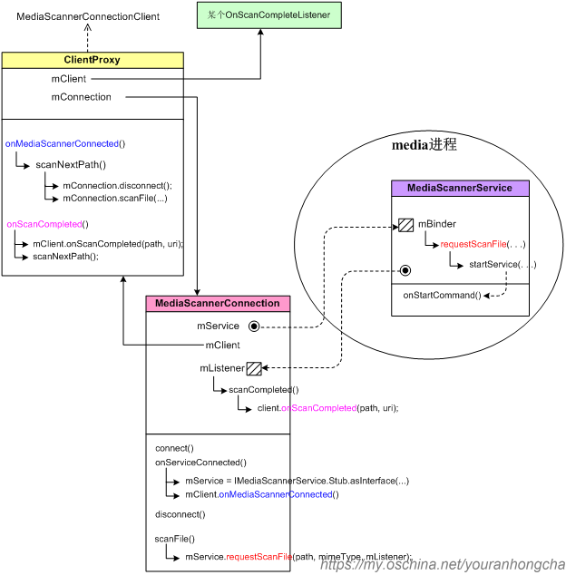
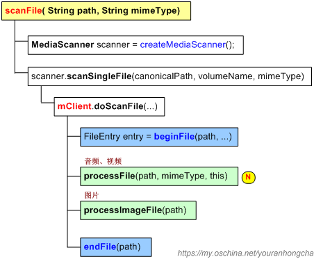
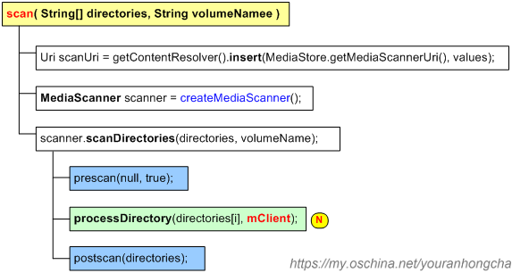
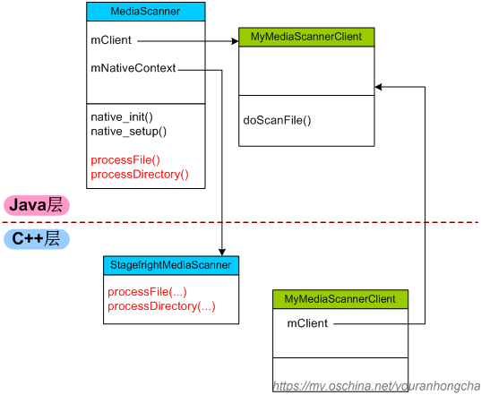
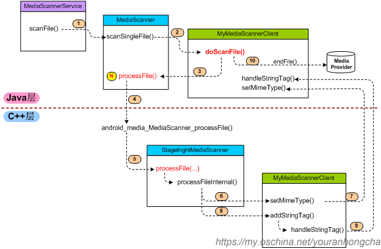
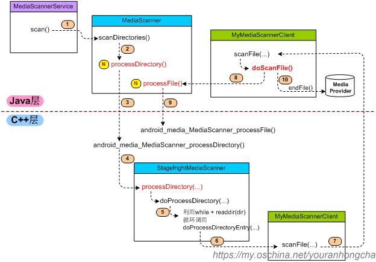

# Android MediaScannerService

MediaScannerService 是 Android 平台提供的一个用于扫描手机中多媒体文件的应用级 service


本文以 Android 5.1 为准



**MediaScannerService 研究**
-------------------


MediaScannerService 是 Android 平台提供的一个用于扫描手机中多媒体文件的应用级 service, 它并不是系统服务。

MediaScannerService 和 MediaProvider 有着非常紧密的关系，因为扫描出的结果总需要存储到某个地方来展现给用户。那么它们具体是如何结合的呢？本文将逐步加以阐述。

### 1 初步了解MediaScannerService

我们先来初步了解一下 MediaScannerService，它在 AndroidManifest.xml 文件里的相关信息如下：  
> packages/providers/mediaprovider/AndroidManifest.xml

```xml
<service android:>
    <intent-filter>
        <action android: />
    </intent-filter>
</service>
```

MediaScannerService 本身继承于 Service，而且还实现了 Runnable 接口。其定义截选如下：  
> packages/providers/mediaprovider/src/com/android/providers/media/MediaScannerService.java

```java
public class MediaScannerService extends Service implements Runnable
{
    private static final String TAG = "MediaScannerService";

    private volatile Looper             mServiceLooper;
    private volatile ServiceHandler     mServiceHandler;
    private PowerManager.WakeLock         mWakeLock;
    private String[]                     mExternalStoragePaths;
    . . . . . .
    private final IMediaScannerService.Stub mBinder = new IMediaScannerService.Stub() 
            . . . . . .
    . . . . . .
}
```

#### 1.1 在 onCreate() 中启动工作线程
------------------------

MediaScannerService 的 onCreate() 函数如下：  
>  packages/providers/mediaprovider/src/com/android/providers/media/MediaScannerService.java

```java
@Override
public void onCreate()
{
    PowerManager pm = (PowerManager)getSystemService(Context.POWER_SERVICE);
    mWakeLock = pm.newWakeLock(PowerManager.PARTIAL_WAKE_LOCK, TAG);
    StorageManager storageManager = 
                  (StorageManager)getSystemService(Context.STORAGE_SERVICE);
    mExternalStoragePaths = storageManager.getVolumePaths();

    // 启动最重要的工作线程，该线程也是个消息泵线程
    Thread thr = new Thread(null, this, "MediaScannerService");
    thr.start();
}
```

可以看到，onCreate() 里会启动最重要的工作线程，该线程也是个消息泵线程。

每当用户需要扫描媒体文件时，基本上都是在向这个消息泵里发送 Message，并在处理 Message 时完成真正的 scan 动作。

请注意，创建 Thread 时传入的第二个参数就是 MediaScannerService 自身，也就是说线程的主要行为其实就是 MediaScannerService 的 `run()` 函数，该函数的代码如下：

```java
public void run()
{
    Process.setThreadPriority(Process.THREAD_PRIORITY_BACKGROUND +
                                   Process.THREAD_PRIORITY_LESS_FAVORABLE);
    Looper.prepare();

    mServiceLooper   = Looper.myLooper();            // 消息looper
    mServiceHandler  = new ServiceHandler();        // 发送消息的handler

    Looper.loop();
}
```

后续就是通过上面那个 mServiceHandler 向消息队列发送 Message 的。

#### 1.2 向工作线程发送 Message
-------------------

比较常见的向消息泵发送 Message 的做法是调用 `startService()`，并在 MediaScannerService 的 `onStartCommand()` 函数里 `sendMessage()`。

比如，和 MediaScannerService 配套提供的 MediaScannerReceiver，当它收到类似 ACTION_BOOT_COMPLETED 这样的系统广播时，就会调用自己的 `scan()` 或 `scanFile()` 函数。而 `scan()` 函数的代码如下：  
> packages/providers/mediaprovider/src/com/android/providers/media/MediaScannerReceiver.java

```java
private void scan(Context context, String volume) {
    Bundle args = new Bundle();
    args.putString("volume", volume);
    context.startService(new Intent(context, MediaScannerService.class).putExtras(args));
}
```

`startService()` 动作会导致走到 service 的 `onStartCommand()`，并进一步发送消息，其函数截选如下：

```java
@Override
public int onStartCommand(Intent intent, int flags, int startId)
{
    . . . . . .
    . . . . . .
    Message msg = mServiceHandler.obtainMessage();
    msg.arg1 = startId;
    msg.obj = intent.getExtras();
    mServiceHandler.sendMessage(msg);    // 发送消息！

    // Try again later if we are killed before we can finish scanning.
    return Service.START_REDELIVER_INTENT;
}
```

另外一种比较常见的发送 Message 的做法是先直接或间接 `bindService()`，绑定成功后会得到一个 IMediaScannerService 接口，而后外界再通过该接口向 MediaScannerService 发起命令，请求其扫描特定文件或目录。

IMediaScannerService 接口只提供了两个接口函数：

- void **requestScanFile**(String path, String mimeType, in IMediaScannerListener listener);
-  void **scanFile**(String path, String mimeType);

处理这两种请求的实体是服务内部的 mBinder 对象，参考代码如下：  
>  packages/providers/mediaprovider/src/com/android/providers/media/MediaScannerService.java

```java
private final IMediaScannerService.Stub mBinder = new IMediaScannerService.Stub() {
    public void requestScanFile(String path, String mimeType, IMediaScannerListener listener) {
        Bundle args = new Bundle();
        args.putString("filepath", path);
        args.putString("mimetype", mimeType);
        if (listener != null) {
            args.putIBinder("listener", listener.asBinder());
        }
        startService(new Intent(MediaScannerService.this, MediaScannerService.class).putExtras(args));
    }

    public void scanFile(String path, String mimeType) {
        requestScanFile(path, mimeType, null);
    }
};
```

说到底还是在调用 `startService()`。

具体处理消息泵线程里的消息时，执行的是 ServiceHandler 的 handleMessage() 函数：

```java
private final class ServiceHandler extends Handler {
    @Override
    public void handleMessage(Message msg) {
        Bundle arguments = (Bundle) msg.obj;
        String filePath = arguments.getString("filepath");
        . . . . . .
        if (filePath != null) {
            . . . . . .
                uri = scanFile(filePath, arguments.getString("mimetype"));
            . . . . . .
        } else {
            . . . . . .
                scan(directories, volume);
            . . . . . .
        }
        . . . . . .
        stopSelf(msg.arg1);
    }
};
```

此时调用的 `scanFile()` 或 `scan()` 函数才是实际进行扫描动作的地方。扫描动作中主要借助的是辅助类 MediaScanner，这个类非常重要，它是打通 Java 层和 C++ 层的关键，扫描动作最终会调用到 MediaScanner 的某个 native 函数，于是程序流程开始走到 C++ 层。

现在，我们可以画一张示意图：



### 2 进行扫描
#### 2.1 发起扫描动作
----------

现在我们已经了解了，要发起扫描动作，大体上只有两种方式：  
1）用广播来发起扫描动作；  
2）绑定服务来发起扫描动作；  
下面我们细说一下这两种方式。

##### 2.1.1 用广播来发起扫描动作

扫描服务的配套 receiver 是 MediaScannerReceiver，它在 `AndroidManifest.xml` 里的描述如下：

```java
<receiver android:>
    <intent-filter>
        <action android: />
    </intent-filter>
    <intent-filter>
        <action android: />
        <data android:scheme="file" />
    </intent-filter>
    <intent-filter>
        <action android: />
        <data android:scheme="file" />
    </intent-filter>
    <intent-filter>
        <action android: />
        <data android:scheme="file" />
    </intent-filter>
</receiver>
```

MediaScannerReceiver 的 `onReceive()` 代码如下：

```java
public void onReceive(Context context, Intent intent) {
    final String action = intent.getAction();
    final Uri uri = intent.getData();
    
    if (Intent.ACTION_BOOT_COMPLETED.equals(action)) {
        // Scan both internal and external storage
        scan(context, MediaProvider.INTERNAL_VOLUME);  // INTERNAL_VOLUME = "internal"
        scan(context, MediaProvider.EXTERNAL_VOLUME);  // EXTERNAL_VOLUME = "external"
    } else {
        if (uri.getScheme().equals("file")) {
            // handle intents related to external storage
            . . . . . .

            Log.d(TAG, "action: " + action + " path: " + path);
            if (Intent.ACTION_MEDIA_MOUNTED.equals(action)) {
                // scan whenever any volume is mounted
                scan(context, MediaProvider.EXTERNAL_VOLUME);
            } else if (Intent.ACTION_MEDIA_SCANNER_SCAN_FILE.equals(action) &&
                    path != null && path.startsWith(externalStoragePath + "/")) {
                scanFile(context, path);
            }
        }
    }
}
```

- 当系统刚刚启动时，收到 ACTION_BOOT_COMPLETED 广播，此时会把内部卷标（“internal”）和外部卷标（“external”）都扫描一下；
- 如果收到 ACTION_MEDIA_MOUNTED 广播，则只扫描外部卷标；
- 如果收到的是 ACTION_MEDIA_SCANNER_SCAN_FILE 广播，则扫描具体的文件路径。

当用户插入了扩展介质（一般指 SD 卡），并且该介质已经被系统正确识别、安装，系统就会发出 ACTION_MEDIA_MOUNTED 广播。从 Android 4.4 开始，ACTION_MEDIA_MOUNTED 广播只能由系统（系统服务 MountService）发出，普通用户是无权发送的。

另外，我们可以通过发送 ACTION_MEDIA_SCANNER_SCAN_FILE 广播，要求 MediaScannerService 扫描一下具体的文件。比如说在 ExternalStorageProvider 的 `openDocument()` 函数里，就会设置监听器监听用户是不是在读写模式下 close 了某个文件，因为 close 一般表示写入动作已经完成了，那么此时就需要 “踢一下”MediaScannerService，提醒它更新一下自己的数据。这段代码截选如下：  

> frameworks/base/packages/externalstorageprovider/src/com/android/externalstorage/ExternalStorageProvider.java

```java
@Override
public ParcelFileDescriptor openDocument(String documentId, String mode, 
                                                 CancellationSignal signal)
                                                 throws FileNotFoundException 
{
    . . . . . .
            // When finished writing, kick off media scanner
            return ParcelFileDescriptor.open(file, pfdMode, mHandler, 
                                                    new OnCloseListener() {
                @Override
                public void onClose(IOException e) {
                    final Intent intent = new Intent(Intent.ACTION_MEDIA_SCANNER_SCAN_FILE);
                    intent.setData(Uri.fromFile(file));
                    getContext().sendBroadcast(intent);    // 用广播来发起扫描动作
                }
            });
    . . . . . .
}
```

##### 2.1.2 用 MediaScannerConnection 来发起扫描动作

除了利用类似 ACTION_MEDIA_SCANNER_SCAN_FILE 这样的广播，系统中还有一种办法可以发起扫描动作，那就是先利用 bindService 机制得到的 IMediaScannerService 代理接口，而后再通过调用该接口的 requestScanFile() 或 scanFile()，同样可以向 MediaScannerService 发出扫描语义。

不过，我们一般并不直白地去 bindService，而是通过一种封装好的辅助类：MediaScannerConnection。该类的定义截选如下： 

> frameworks/base/media/java/android/media/MediaScannerConnection.java

```java
public class MediaScannerConnection implements ServiceConnection {
    private static final String TAG = "MediaScannerConnection";
    private Context mContext;
    private MediaScannerConnectionClient mClient;
    private IMediaScannerService mService;
    private boolean mConnected; // true if connect() has been called since last disconnect()
    private final IMediaScannerListener.Stub mListener = new IMediaScannerListener.Stub()
    . . . . . .
```

请注意那个 mService 成员，它就是为了绑定 service 而设计的。

MediaScannerConnection 里设计了两个 scanFile() 函数，一个动态的，一个静态的。大家不要搞混了。


###### 2.1.2.1 动态形式 scanFile()

动态形式 `scanFile()` 的代码截选：

```java
public void scanFile(String path, String mimeType) {
    . . . . . .
            mService.requestScanFile(path, mimeType, mListener);
    . . . . . .
}
```

对于动态形式的 scanFile() 而言，它只能在 MediaScannerConnection 成功绑定到 MediaScannerService 之后调用，此时它简单地调用 mService.requestScanFile() 将语义传递给 MediaScannerService，再由 MediaScannerService 通过 startService() 向自己的消息泵线程打入消息。

`mService.requestScanFile()` 的最后一个参数 mListener 的定义如下：

```java
private final IMediaScannerListener.Stub mListener = new IMediaScannerListener.Stub() {
    public void scanCompleted(String path, Uri uri) {
        MediaScannerConnectionClient client = mClient;
        if (client != null) {
            client.onScanCompleted(path, uri);
        }
    }
};
```

它是个简单的 binder 实体。每当 MediaScannerService 扫描完所指定的一个文件后，就会回调到该实体的 `scanCompleted()`。此时一般会经由 `client.onScanCompleted() `一句间接调用下一次 scanFile() 的动作，从而使扫描多个文件的动作连贯起来。

###### 2.1.2.2 静态形式 scanFile()

静态形式 `scanFile()` 的代码截选：

```java
public static void scanFile(Context context, String[] paths, String[] mimeTypes,
                            OnScanCompletedListener callback) {
    ClientProxy client = new ClientProxy(paths, mimeTypes, callback);
    MediaScannerConnection connection = new MediaScannerConnection(context, client);
    client.mConnection = connection;
    connection.connect();  // 内部主要是bindService动作
}
```

对于静态形式的 scanFile() 而言，会重新创建一个 MediaScannerConnection 对象，并通过 connect() 动作和 MediaScannerService 联系起来。

请大家注意创建 MediaScannerConnection 时传入的第二个参数 client，它必须实现 MediaScannerConnectionClient 接口。说穿了是为了监听两种事情：  
1）和 MediaScannerService 之间的连接是否建立好了；  
2）MediaScannerService 中扫描某文件的动作是否执行完了；

MediaScannerConnectionClient 接口的定义如下：  
>  frameworks/base/media/java/android/media/MediaScannerConnection.java

```java
public interface MediaScannerConnectionClient extends OnScanCompletedListener {
    public void onMediaScannerConnected();
    public void onScanCompleted(String path, Uri uri);
}
```

在静态形式的 `scanFile()` 中，实现 MediaScannerConnectionClient 接口的类是 ClientProxy，它是这样实现 `onMediaScannerConnected()` 和 `onScanCompleted()` 的：  
>  frameworks/base/media/java/android/media/MediaScannerConnection.java

```java
public void onMediaScannerConnected() {
    scanNextPath();
}

public void onScanCompleted(String path, Uri uri) {
    if (mClient != null) {
        mClient.onScanCompleted(path, uri);
    }
    scanNextPath();
}
```

可以看到一旦连接建立成功或者某个文件扫描完毕，就会调用 `scanNextPath()`，进一步扫描接下来的内容，直到把调用静态 `scanFile()` 时传入的 paths 数组遍历完毕。

```java
void scanNextPath() {
    if (mNextPath >= mPaths.length) {
        mConnection.disconnect();
        return;
    }
    String mimeType = mMimeTypes != null ? mMimeTypes[mNextPath] : null;
    mConnection.scanFile(mPaths[mNextPath], mimeType);
    mNextPath++;
}
```

实际上，MediaScannerConnection 的 `connect()` 动作就是在 `bindService()`，它的代码如下：  
>  frameworks/base/media/java/android/media/MediaScannerConnection.java

```java
public void connect() {
    synchronized (this) {
        if (!mConnected) {
            Intent intent = new Intent(IMediaScannerService.class.getName());
            intent.setComponent( new ComponentName("com.android.providers.media",
                                        "com.android.providers.media.MediaScannerService"));
            mContext.bindService(intent, this, Context.BIND_AUTO_CREATE);
            mConnected = true;
        }
    }
}
```

因为 `bindService()` 动作本身是异步的，初始时 mService 的值还是 null，所以我们不能直接在这里执行类似 `mService.requestScanFile()` 这样的操作。我们必须等到 bind 动作成功完成，系统回调到 MediaScannerConnection 的 `onServiceConnected()`，才会给 mService 赋值：

```java
public void onServiceConnected(ComponentName className, IBinder service) {
    . . . . . .
    synchronized (this) {
        mService = IMediaScannerService.Stub.asInterface(service);
        if (mService != null && mClient != null) {
            mClient.onMediaScannerConnected();
        }
    }
}
```

如果 bind 动作是成功的，而且用户在构造 MediaScannerConnection 对象时传入了 client 参数。那么此时就会回调 mClient 的 `onMediaScannerConnected()` 函数。

请注意，静态的 `scanFile()` 方法最终并没有直接执行 `requestScanFile()`，它先建立了和 MediaScannerService 的绑定关系，然后在 `onServiceConnected()` 中感知到绑定已经成功之后，才会经由 ClientProxy 间接转过头调用到自己的 `scanFile()` 函数，从而执行到 `requestScanFile()`。

ClientProxy、MediaScannerConnection、MediaScannerService 三者之间的关系如下图所示：



以 MediaScannerConnection 对象为桥梁：  
1）其 mService“指向”MediaScannerService 的 mBinder；  
2）其 mClient 指向 ClientProxy 对象；

当然，在看懂上图后，我们也可以不使用默认的 ClientProxy，而添加我们自定义的 client 对象，只要这个 client 对象实现了 MediaScannerConnectionClient 接口即可。比如在 MediaProvider 中，就定义了另一个类 ScannerClient 类，代码截选如下：  
>  packages/providers/mediaprovider/src/com/android/providers/media/MediaProvider.java

```java
private static final class ScannerClient implements MediaScannerConnectionClient {
    String mPath = null;
    MediaScannerConnection mScannerConnection;
    SQLiteDatabase mDb;

    public ScannerClient(Context context, SQLiteDatabase db, String path) {
        mDb = db;
        mPath = path;
        mScannerConnection = new MediaScannerConnection(context, this);
        mScannerConnection.connect();
    }

    @Override
    public void onMediaScannerConnected() {
        . . . . . .
    }

    @Override
    public void onScanCompleted(String path, Uri uri) {
    }
}
```

这么看来，MediaScannerConnection 还真是起连接作用的 “connection”，它将发起扫描请求的 client 和最终执行扫描动作的 MediaScannerService 连接起来了。我们把上面那张图简化一下，可以看到如下示意图：


以上介绍的就是发起 scan 动作的方法，接下来我们来看看到底有哪些地方在使用这些方法。

#### 2.2 谁会发起扫描动作
------------

##### 2.2.1 发起者列表

发出 ACTION_MEDIA_SCANNER_SCAN_FILE 广播的地方：

<table><tbody><tr><td><strong>发起方</strong></td><td><strong>相关代码位置</strong></td><td><strong>说明</strong></td></tr><tr><td>ExternalStorageProvider</td><td>openDocument() 注册 OnCloseListener 的地方</td><td>&nbsp;</td></tr><tr><td>ComposeMessageActivity</td><td>MMS 里 copyPart() 函数中</td><td>saveRingtone()、<br>copyMedia() 中都会调用 copyPart()。</td></tr><tr><td>DownloadProvider</td><td>openFile() 注册 OnCloseListener 的地方</td><td>&nbsp;</td></tr><tr><td>EmlAttachmentProvider</td><td>copyAttachment()，将附件拷到外部下载目录（一般是 SD 卡）时&nbsp;</td><td>provider 在 update() 中处理 ATTACHMENT 的地方</td></tr><tr><td>SoundRecorder</td><td>addToMediaDB()&nbsp;</td><td>录制 sample 后，要添加进多媒体数据库</td></tr></tbody></table>


利用 MediaScannerConnection 的地方：

<table><tbody><tr><td><strong>发起方</strong></td><td><strong>相关代码位置</strong></td><td><strong>说明</strong></td></tr><tr><td>AttachmentUtilities</td><td>saveAttachment()</td><td>代码截选见下文</td></tr><tr><td>BeamTransferManager</td><td>processFiles()</td><td>NFC 方面，<br>finishTransfer()、handleMessage() 处理 MSG_NEXT_TRANSFER_TIMER 时，都会调用 processFiles()。</td></tr><tr><td>BluetoothOppService</td><td>MediaScannerNotifier</td><td>没有直接使用 MediaScannerConnection.scanFile()，而是编写了自己的 MediaScannerNotifier</td></tr><tr><td>CalendarDebugActivity</td><td>doInBackground()&nbsp;</td><td>DumpDbTask 的 doInBackground()，将数据库文件存成 calendar.db.zip 之后，调用 MediaScannerConnection.scanFile()</td></tr><tr><td>DownloadScanner</td><td>DownloadScanner</td><td>没有直接使用 MediaScannerConnection.scanFile()，而是编写了自己的 DownloadScanner</td></tr><tr><td>FmRecorder</td><td>addRecordingToDatabase()</td><td>MediaScannerConnection.scanFile(context,&nbsp;<br>new String[] { mRecordFile.getPath() },<br>&nbsp; &nbsp; &nbsp; &nbsp; &nbsp; &nbsp; &nbsp; &nbsp; null, null);</td></tr><tr><td>IngestService</td><td>ScannerClient&nbsp;</td><td>没有直接使用 MediaScannerConnection.scanFile()，而是编写了自己的 ScannerClient</td></tr><tr><td>MediaProvider</td><td>ScannerClient&nbsp;</td><td>没有直接使用 MediaScannerConnection.scanFile()，而是编写了自己的 ScannerClient</td></tr><tr><td>VCardService</td><td>CustomeMediaScannerConnectionClient</td><td>没有直接使用 MediaScannerConnection.scanFile()，而是编写了自己的 CustomeMediaScannerConnectionClient</td></tr></tbody></table>

##### 2.2.2 saveAttachment() 中的示例代码

我们举一个实际的例子。在 Email 模块中，如果附件存入了外部存储器，那么就有必要扫描一次媒体文件了，这样才能够立即将相关文件体现到 Gallery、Music 中。所以在 saveAttachment() 函数里，就会调用 `MediaScannerConnection.scanFile()`：  
>  packages/apps/email/emailcommon/src/com/android/emailcommon/utility/AttachmentUtilities.java

```java
public static void saveAttachment(Context context, InputStream in, Attachment attachment) {
    . . . . . .
        ContentResolver resolver = context.getContentResolver();
        if (attachment.mUiDestination == UIProvider.AttachmentDestination.CACHE) {
            . . . . . .
        } else if (Utility.isExternalStorageMounted()) {
            . . . . . .
            File file = Utility.createUniqueFile(downloads, attachment.mFileName);
            size = copyFile(in, new FileOutputStream(file));
            String absolutePath = file.getAbsolutePath();

            // 尽管下载管理器会扫描媒体文件，但只会在用户运行download APP并点击相关按钮后，
            // 才会进行扫描。所以，我们自己运行一下media scanner，以便把附件立即添加进gallery / music。
            MediaScannerConnection.scanFile(context, new String[] {absolutePath}, 
                                                  null, null);
            . . . . . .
                DownloadManager dm = (DownloadManager) 
                                      context.getSystemService(Context.DOWNLOAD_SERVICE);
                long id = dm.addCompletedDownload(attachment.mFileName, 
                        attachment.mFileName,
                        false /* do not use media scanner */,
                        mimeType, absolutePath, size,
                        true /* show notification */);
                contentUri = dm.getUriForDownloadedFile(id).toString();
            . . . . . .
        } else {
            . . . . . .
            throw new IOException();
        }
    . . . . . .
    context.getContentResolver().update(uri, cv, null, null);
}
```

#### 2.3 说说实际的扫描动作
-------------

前文介绍 MediaScannerService 的消息泵线程时已经说过，最终 ServiceHandler 的 handleMessage() 会调用 scanFile() 或 scan() 来完成扫描。现在我们来看看 scanFile()、scan() 的细节。

#### 2.3.1 scanFile() 动作

MediaScannerService 的 scanFile() 定义如下：  
>  packages/providers/mediaprovider/src/com/android/providers/media/MediaScannerService.java

```java
private Uri scanFile(String path, String mimeType) {
    String volumeName = MediaProvider.EXTERNAL_VOLUME;
    openDatabase(volumeName);
    MediaScanner scanner = createMediaScanner();
    try {
        String canonicalPath = new File(path).getCanonicalPath();
        return scanner.scanSingleFile(canonicalPath, volumeName, mimeType);
    } catch (Exception e) {
        Log.e(TAG, "bad path " + path + " in scanFile()", e);
        return null;
    }
}
```

可以看到，`scanFile()` 函数内部借助了辅助类 MediaScanner，调用了该类的 `scanSingleFile()`。这个 MediaScanner 才是重头戏，它的 `scanSingleFile()` 代码截选如下：   
>  frameworks/base/media/java/android/media/MediaScanner.java

```java
public Uri scanSingleFile(String path, String volumeName, String mimeType) {
    . . . . . .
        initialize(volumeName);
        prescan(path, true);
        File file = new File(path);
        . . . . . .
        // always scan the file, so we can return the content://media Uri for existing files
        return mClient.doScanFile(path, mimeType, lastModifiedSeconds, file.length(),
                false, true, MediaScanner.isNoMediaPath(path));
    . . . . . .
}
```

借助了 `mClient.doScanFile()`。

此处的 mClient 类型为 MyMediaScannerClient，mClient 的定义是：

```java
private final MyMediaScannerClient mClient = new MyMediaScannerClient();
```

MyMediaScannerClient 类的 doScanFile() 的代码截选如下：  
>  frameworks/base/media/java/android/media/MediaScanner.java

```java
public Uri doScanFile(String path, String mimeType, long lastModified,
        long fileSize, boolean isDirectory, boolean scanAlways, boolean noMedia) {
    . . . . . .
        FileEntry entry = beginFile(path, mimeType, lastModified,
                fileSize, isDirectory, noMedia);
        . . . . . .
        if (entry != null && (entry.mLastModifiedChanged || scanAlways)) {
            if (noMedia) {
                result = endFile(entry, false, false, false, false, false);
            } else {
                . . . . . .
                . . . . . .
                // we only extract metadata for audio and video files
                if (isaudio || isvideo) {
                    processFile(path, mimeType, this);
                }
                if (isimage) {
                    processImageFile(path);
                }

                result = endFile(entry, ringtones, notifications, alarms, music, podcasts);
            }
        }
    . . . . . .
    return result;
}
```

因为 MyMediaScannerClient 是 MediaScanner 的内嵌类，所以它可以直接调用 MediaScanner 的 `processFile()`。

现在我们画一张 `scanFile()` 的调用关系图：



##### 2.3.2 scan() 动作

与 scanFile() 动作类似，MediaScannerService 中扫描目录的动作是 `scan()`：  
>  packages/providers/mediaprovider/src/com/android/providers/media/MediaScannerService.java

```java
private void scan(String[] directories, String volumeName) {
. . . . . .
    values.put(MediaStore.MEDIA_SCANNER_VOLUME, volumeName);
    Uri scanUri = getContentResolver().insert(MediaStore.getMediaScannerUri(), values);
    . . . . . .
            MediaScanner scanner = createMediaScanner();
            scanner.scanDirectories(directories, volumeName);
    . . . . . .
        sendBroadcast(new Intent(Intent.ACTION_MEDIA_SCANNER_FINISHED, uri));
    . . . . . .
}
```

同样是借助了辅助类 MediaScanner，调用了该类的 `scanDirectories()`。

scanDirectories() 的代码截选如下：  
>  frameworks/base/media/java/android/media/MediaScanner.java

```java
public void scanDirectories(String[] directories, String volumeName) {
    . . . . . . 
        for (int i = 0; i < directories.length; i++) {
            processDirectory(directories[i], mClient);
        }
    . . . . . .
}
```

我们画一张 scan() 的调用关系图：



##### 2.3.3 MediaScanner

顾名思义，MediaScanner 就是个 “媒体文件扫描器”。它必须打通 java 层次和 C++ 层次。请大家注意它的两个 native 函数：`native_init()` 和 `native_setup()`，以及两个重要成员变量：一个是上文刚刚提到的 mClient 成员，另一个是 mNativeContext。

MediaScanner 的相关代码截选如下：  
>  frameworks/base/media/java/android/media/MediaScanner.java

```java
public class MediaScanner
{
    static {
        System.loadLibrary("media_jni");
        native_init();    // 将java层和c++层联系起来
    }
    . . . . . .
    private long mNativeContext;
    . . . . . .
    public MediaScanner(Context c) {
        native_setup();
        . . . . . .
    }
    . . . . . .
    // 一开始就具有明确的mClient对象
    private final MyMediaScannerClient mClient = new MyMediaScannerClient();
    . . . . . .
}
```

MediaScanner 类加载之时，就会同时加载动态链接库 “media_jni”，并调用 native_init() 将 java 层和 c++ 层联系起来。而且 MediaScanner 对象一开始就具有明确的 mClient 对象，类型为 MyMediaScannerClient。

经过分析代码，我们发现在 C++ 层会有个与 MediaScanner 相对应的类，叫作 StagefrightMediaScanner。当 java 层创建 MediaScanner 对象时，MediaScanner 的构造函数就调用了 native_setup()，该函数对应到 C++ 层就是 `android_media_MediaScanner_native_setup()`，其代码如下：  
>  frameworks/base/media/jni/android_media_MediaScanner.cpp

```cpp
static void
android_media_MediaScanner_native_setup(JNIEnv *env, jobject thiz)
{
    ALOGV("native_setup");
    MediaScanner *mp = new StagefrightMediaScanner;
    if (mp == NULL) {
        jniThrowException(env, kRunTimeException, "Out of memory");
        return;
    }
    env->SetLongField(thiz, fields.context, (jlong)mp);
}
```

最后一句 `env->SetLongField()` 其实就是在为 java 层 MediaScanner 的 mNativeContext 域赋值。

后续我们会看到，每当 C++ 层执行扫描动作时，还会再创建一个 MyMediaScannerClient 对象，这个对象和 Java 层的同名类对应。我们画一张图来说明：



##### 2.3.4 调用到 C++ 层次

不管是扫描文件，还是扫描目录，总之 MediaScannerService 已经把工作委托给 MediaScanner 的 `scanSingleFile()` 和 `scanDirectories()` 了，而这两个函数到头来都是调用 MediaScanner 自己的 native 函数，即 `processFile()` 和 `processDirectory()`。其声明如下：  
>  frameworks/base/media/java/android/media/MediaScanner.java

```java
private native void processDirectory(String path, MediaScannerClient client);
private native void processFile(String path, String mimeType, MediaScannerClient client);
```

MediaScanner 中调用的 `processFile()` 对应于 C++ 层的 `android_media_MediaScanner_processFile()`。代码截选如下：  
>  frameworks/base/media/jni/android_media_MediaScanner.cpp

```cpp
static void android_media_MediaScanner_processFile(
                JNIEnv *env, jobject thiz, jstring path,
                jstring mimeType, jobject client)
{
    . . . . . .
    MediaScanner *mp = getNativeScanner_l(env, thiz);
    . . . . . .
    const char *mimeTypeStr =
        (mimeType ? env->GetStringUTFChars(mimeType, NULL) : NULL);
    if (mimeType && mimeTypeStr == NULL) {  // Out of memory
        // ReleaseStringUTFChars can be called with an exception pending.
        env->ReleaseStringUTFChars(path, pathStr);
        return;
    }

    MyMediaScannerClient myClient(env, client);        // 构造一个临时的myClient
    MediaScanResult result = mp->processFile(pathStr, mimeTypeStr, myClient);
    if (result == MEDIA_SCAN_RESULT_ERROR) {
        ALOGE("An error occurred while scanning file '%s'.", pathStr);
    }
    . . . . . .
}
```

注意这里构造了一个局部的（C++ 层次）MyMediaScannerClient 对象，构造 myClient 时传入的 client 参数来自于 Java 层调用 processFile() 时传入的那个（Java 层次）MyMediaScannerClient 对象。这个对象会记录在 C++ 层 MyMediaScannerClient 的 mClient 域中，这个在前面的示意图中已有表示。

相应的，`processDirectory()` 对应于 C++ 层的 `android_media_MediaScanner_processDirectory()`。代码截选如下：  
>  frameworks/base/media/jni/android_media_MediaScanner.cpp

```cpp
static void android_media_MediaScanner_processDirectory(
        JNIEnv *env, jobject thiz, jstring path, jobject client)
{
    . . . . . .
    MediaScanner *mp = getNativeScanner_l(env, thiz);
    . . . . . .
    MyMediaScannerClient myClient(env, client);
    MediaScanResult result = mp->processDirectory(pathStr, myClient);
    . . . . . .
}
```

###### 2.3.4.1 processFile()

`android_media_MediaScanner_processFile()` 函数中的那个 mp 是经由下面这句得到的：

```cpp
MediaScanner *mp = getNativeScanner_l(env, thiz);
```

它指向的其实就是 StagefrightMediaScanner，所以这里调用的 processFile 就是：  
>  frameworks/av/media/libstagefright/StagefrightMediaScanner.cpp

```cpp
MediaScanResult StagefrightMediaScanner::processFile(
        const char *path, const char *mimeType,
        MediaScannerClient &client) {
    ALOGV("processFile '%s'.", path);

    client.setLocale(locale());
    client.beginFile();
    MediaScanResult result = processFileInternal(path, mimeType, client);
    client.endFile();
    return result;
}
```

主要行为在 `processFileInternal()` 里：  
>  frameworks/av/media/libstagefright/StagefrightMediaScanner.cpp

```cpp
MediaScanResult StagefrightMediaScanner::processFileInternal(
        const char *path, const char * /* mimeType */,
        MediaScannerClient &client) {
    const char *extension = strrchr(path, '.');
    . . . . . .
    if (!FileHasAcceptableExtension(extension)) {
        return MEDIA_SCAN_RESULT_SKIPPED;
    }

    if (!strcasecmp(extension, ".mid")
            || !strcasecmp(extension, ".smf")
            || !strcasecmp(extension, ".imy")
            . . . . . .
        return HandleMIDI(path, &client);
    }

    sp<MediaMetadataRetriever> mRetriever(new MediaMetadataRetriever);
    int fd = open(path, O_RDONLY | O_LARGEFILE);
    . . . . . .
        status = mRetriever->setDataSource(fd, 0, 0x7ffffffffffffffL);
        close(fd);
    . . . . . .

    const char *value;
    if ((value = mRetriever->extractMetadata(
                    METADATA_KEY_MIMETYPE)) != NULL) {
        status = client.setMimeType(value);
        . . . . . .
    }

    struct KeyMap {
        const char *tag;
        int key;
    };
    static const KeyMap kKeyMap[] = {
        { "tracknumber", METADATA_KEY_CD_TRACK_NUMBER },
        { "discnumber", METADATA_KEY_DISC_NUMBER },
        { "album", METADATA_KEY_ALBUM },
        { "artist", METADATA_KEY_ARTIST },
        . . . . . .
    };
    static const size_t kNumEntries = sizeof(kKeyMap) / sizeof(kKeyMap[0]);
    for (size_t i = 0; i < kNumEntries; ++i) {
        const char *value;
        if ((value = mRetriever->extractMetadata(kKeyMap[i].key)) != NULL) {
            status = client.addStringTag(kKeyMap[i].tag, value);
            . . . . . .
        }
    }
    return MEDIA_SCAN_RESULT_OK;
}
```

可以看到，`processFileInternal()` 里扫描具体文件的大体流程，无非是先获取多媒体文件的元数据，然后再通过 MyMediaScannerClient 将元数据信息从 C++ 层传递到 Java 层。

`processFileInternal()` 里的主要细节有：

1）调用 FileHasAcceptableExtension() 函数，看看文件的扩展名是不是属于多媒体文件扩展名，合适的扩展名有：

>  frameworks/av/media/libstagefright/StagefrightMediaScanner.cpp

```cpp
static bool FileHasAcceptableExtension(const char *extension) {
    static const char *kValidExtensions[] = {
        ".mp3", ".mp4", ".m4a", ".3gp", ".3gpp", ".3g2", ".3gpp2",
        ".mpeg", ".ogg", ".mid", ".smf", ".imy", ".wma", ".aac",
        ".wav", ".amr", ".midi", ".xmf", ".rtttl", ".rtx", ".ota",
        ".mkv", ".mka", ".webm", ".ts", ".fl", ".flac", ".mxmf",
        ".avi", ".mpeg", ".mpg", ".awb", ".mpga"
    };
    . . . . . .
}
```

如果扩展名不合适，则直接 return MEDIA_SCAN_RESULT_SKIPPED。

2）看看文件是不是 midi 文件，如果是 midi 文件，则以 HandleMIDI() 来处理。  
>  frameworks/av/media/libstagefright/StagefrightMediaScanner.cpp

```cpp
if (!strcasecmp(extension, ".mid")
            || !strcasecmp(extension, ".smf")
            || !strcasecmp(extension, ".imy")
            || !strcasecmp(extension, ".midi")
            || !strcasecmp(extension, ".xmf")
            || !strcasecmp(extension, ".rtttl")
            || !strcasecmp(extension, ".rtx")
            || !strcasecmp(extension, ".ota")
            || !strcasecmp(extension, ".mxmf")) {
        return HandleMIDI(path, &client);
    }
```

从 `HandleMIDI()` 的代码看，要解析并提取 midi 文件的元数据，需要用到一种 EAS 引擎，利用 `EAS_ParseMetaData()` 解析出时长信息。并调用 MyMediaScannerClient 的 `addStringTag()`。

3）如果是其他支持的多媒体文件，则利用工具类 MediaMetadataRetriever 来获取文件的元数据，并将得到的元数据传递给 MyMediaScannerClient。  
其实 MediaMetadataRetriever 内部是利用系统服务 “media.player” 来解析多媒体文件的，这个系统服务对应的代理接口是 IMediaPlayerService，它有个成员函数 `createMetadataRetriever()`可以用于获取 IMediaMetadataRetriever 接口，而后就可以调用该接口的 `setDataSource()`和 `extractMetadata()`了。

`processFileInternal()` 里主要通过两个函数，向 Java 层的 MyMediaScannerClient 传递数据，一个是 `setMimeType()`，另一个是 `addStringTag()`。以 C++ 层的 `setMimeType()` 为例，其代码如下：  
>  frameworks/base/media/jni/android_media_MediaScanner.cpp

```cpp
virtual status_t setMimeType(const char* mimeType)
{
    ALOGV("setMimeType: %s", mimeType);
    jstring mimeTypeStr;
    if ((mimeTypeStr = mEnv->NewStringUTF(mimeType)) == NULL) {
        mEnv->ExceptionClear();
        return NO_MEMORY;
    }

    mEnv->CallVoidMethod(mClient, mSetMimeTypeMethodID, mimeTypeStr);
    mEnv->DeleteLocalRef(mimeTypeStr);
    return checkAndClearExceptionFromCallback(mEnv, "setMimeType");
}
```

基本上只是通过 JNI 技术，调用到 Java 层的 setMimeType() 而已。

现在我们画一张关于扫描文件的简单示意图，来整理一下思路。大家顺着箭头看图就可以了。



###### 2.3.4.2 processDirectory()

按理说，和 `processFile()` 类似，`processDirectory()` 最终对应的代码也应该在 StagefrightMediaScanner 里，但是 StagefrightMediaScanner 并没有编写这个函数，又因为 StagefrightMediaScanner 继承于 MediaScanner（C++ 层次），所以实际上使用的是 MediaScanner 的 `ProcessDirectory()`  
>  frameworks/av/media/libmedia/MediaScanner.cpp

```cpp
MediaScanResult MediaScanner::processDirectory(
        const char *path, MediaScannerClient &client) {
    int pathLength = strlen(path);
    . . . . . .
    char* pathBuffer = (char *)malloc(PATH_MAX + 1);
    . . . . . .
    strcpy(pathBuffer, path);
    . . . . . .
    client.setLocale(locale());
    MediaScanResult result = doProcessDirectory(pathBuffer, pathRemaining, client, false);
    free(pathBuffer);
    return result;
}
```

>  frameworks/av/media/libmedia/MediaScanner.cpp

```cpp
MediaScanResult MediaScanner::doProcessDirectory(char *path, int pathRemaining, 
                                                 MediaScannerClient &client, bool noMedia) {
    char* fileSpot = path + strlen(path);
    struct dirent* entry;

    if (shouldSkipDirectory(path)) {
        . . . . . .
        return MEDIA_SCAN_RESULT_OK;
    }

    // Treat all files as non-media in directories that contain a  ".nomedia" file
    if (pathRemaining >= 8 /* strlen(".nomedia") */ ) {
        strcpy(fileSpot, ".nomedia");
        if (access(path, F_OK) == 0) {
            ALOGV("found .nomedia, setting noMedia flag");
            noMedia = true;
        }
        . . . . . .
    }

    DIR* dir = opendir(path);
    . . . . . .
    MediaScanResult result = MEDIA_SCAN_RESULT_OK;
    while ((entry = readdir(dir))) {
        if (doProcessDirectoryEntry(path, pathRemaining, client, noMedia, entry, fileSpot)
                == MEDIA_SCAN_RESULT_ERROR) {
            result = MEDIA_SCAN_RESULT_ERROR;
            break;
        }
    }
    closedir(dir);
    return result;
}
```

`doProcessDirectory()`先判断需要扫描的目录是不是应该 “跳过” 的目录，如果是的话，则直接 `return MEDIA_SCAN_RESULT_OK`。判断函数 `shouldSkipDirectory()`的代码如下：  
>  frameworks/av/media/libmedia/MediaScanner.cpp

```cpp
bool MediaScanner::shouldSkipDirectory(char *path) {
    if (path && mSkipList && mSkipIndex) {
        int len = strlen(path);
        int idx = 0;
        int startPos = 0;
        while (mSkipIndex[idx] != -1) {
            if ((len == mSkipIndex[idx])
                && (strncmp(path, &mSkipList[startPos], len) == 0)) {
                return true;
            }
            startPos += mSkipIndex[idx] + 1; // extra char for the delimiter
            idx++;
        }
    }
    return false;
}
```

其实就是比对一下 “需要扫描的目录” 是否存在于 mSkipList 列表中。这个列表的内容其实来自于 “testing.mediascanner.skiplist” 属性，该属性可以记录若干目录名，目录名之间以逗号分隔。在 C++ 层的 MediaScanner 构造函数中，会调用 `loadSkipList()`来读取这个属性，解析属性中记录的所有目录名并写入 mSkipList 列表。

接着` doProcessDirectory() `用一个 while 循环多次调用 `doProcessDirectoryEntry()`，其内部在必要时候，会再次调用 `doProcessDirectory()` 分析子目录。while 语句的循环判断部分用到了 `readdir()` 函数，`readdir()` 是 linux 上返回所指目录中 “下一个进入点”（next entry）的函数，我们常常在一个 while 循环中调用它，以便遍历出目录中的所有内容。

doProcessDirectoryEntry() 函数的定义截选如下：  
>  frameworks/av/media/libmedia/MediaScanner.cpp

```cpp
MediaScanResult MediaScanner::doProcessDirectoryEntry(
        char *path, int pathRemaining, MediaScannerClient &client, bool noMedia,
        struct dirent* entry, char* fileSpot) {
    struct stat statbuf;
    const char* name = entry->d_name;

    . . . . . .
    int type = entry->d_type;
    . . . . . .
    if (type == DT_DIR) {   // 普通目录
        . . . . . .
        if (stat(path, &statbuf) == 0) {
            status_t status = client.scanFile(path, statbuf.st_mtime, 0,
                    true /*isDirectory*/, childNoMedia);
            . . . . . .
        }

        // and now process its contents
        strcat(fileSpot, "/");
        MediaScanResult result = doProcessDirectory(path, pathRemaining - nameLength - 1,
                client, childNoMedia);
        . . . . . .
    } else if (type == DT_REG) {    // 普通文件
        stat(path, &statbuf);
        status_t status = client.scanFile(path, statbuf.st_mtime, statbuf.st_size,
                false /*isDirectory*/, noMedia);
        . . . . . .
    }
    return MEDIA_SCAN_RESULT_OK;
}
```

不管当前处理的入口类型是 “目录” 还是 “文件”，最终都是依靠 client 的 scanFile() 来处理，只不过前者倒数第二个参数（isDirectory）为 true，后者为 false 而已。

`client.scanFile()` 最终也是要调回到 Java 层的，MyMediaScannerClient 的 scanFile() 代码截选如下：  
>  frameworks/base/media/jni/android_media_MediaScanner.cpp

```cpp
virtual status_t scanFile(const char* path, long long lastModified,
        long long fileSize, bool isDirectory, bool noMedia)
{
    . . . . . .
    jstring pathStr;
    if ((pathStr = mEnv->NewStringUTF(path)) == NULL) {
        mEnv->ExceptionClear();
        return NO_MEMORY;
    }
    mEnv->CallVoidMethod(mClient, mScanFileMethodID, pathStr, lastModified,
            fileSize, isDirectory, noMedia);
    mEnv->DeleteLocalRef(pathStr);
    return checkAndClearExceptionFromCallback(mEnv, "scanFile");
}
```

>  frameworks/base/media/java/android/media/MediaScanner.java

```java
@Override
public void scanFile(String path, long lastModified, long fileSize,
        boolean isDirectory, boolean noMedia) {
    doScanFile(path, null, lastModified, fileSize, isDirectory, false, noMedia);
}
```

调用到 `doScanFile()` 函数。

现在我们再画一张关于扫描目录的简单示意图：



###### 2.3.4.3 doScanFile() 和 MediaProvider

站在 Java 层次来看，不管是扫描具体的文件，还是扫描一个目录，最终都会走到 Java 层 MyMediaScannerClient 的 `doScanFile()`。在前文我们已经列出过这个函数的代码，为了说明问题，这里再列一下其中的重要句子：  
>  frameworks/base/media/java/android/media/MediaScanner.java

```java
public Uri doScanFile(String path, String mimeType, long lastModified,
        long fileSize, boolean isDirectory, boolean scanAlways, boolean noMedia) {
    . . . . . .
        FileEntry entry = beginFile(path, mimeType, lastModified,
                fileSize, isDirectory, noMedia);
        . . . . . .
                if (isaudio || isvideo) {
                    processFile(path, mimeType, this);
                }
                if (isimage) {
                    processImageFile(path);
                }
                result = endFile(entry, ringtones, notifications, alarms, music, podcasts);
    . . . . . .
    return result;
}
```

本小节着重看一下其中和 MediaProvider 相关的 `beginFile()` 和 `endFile()`。

`beginFile()` 是为了后续和 MediaProvider 打交道，准备一个 FileEntry。FileEntry 的定义如下：  
>  frameworks/base/media/java/android/media/MediaScanner.java

```java
private static class FileEntry {
    long mRowId;
    String mPath;
    long mLastModified;
    int mFormat;
    boolean mLastModifiedChanged;

    FileEntry(long rowId, String path, long lastModified, int format) {
        mRowId = rowId;
        mPath = path;
        mLastModified = lastModified;
        mFormat = format;
        mLastModifiedChanged = false;
    }
    . . . . . .
}
```

FileEntry 的几个成员变量，其实体现了查表时的若干列的值。

`beginFile()` 的代码截选如下：  
>  frameworks/base/media/java/android/media/MediaScanner.java

```java
public FileEntry beginFile(String path, String mimeType, long lastModified,
        long fileSize, boolean isDirectory, boolean noMedia) {
    . . . . . .
    FileEntry entry = makeEntryFor(path);   // 从MediaProvider中查出该文件或目录对应的入口
    . . . . . .
    if (entry == null || wasModified) {
        if (wasModified) {
            entry.mLastModified = lastModified;
        } else {
            // 如果前面没查到FileEntry，就在这里new一个新的FileEntry
            entry = new FileEntry(0, path, lastModified,
                    (isDirectory ? MtpConstants.FORMAT_ASSOCIATION : 0));
        }
        entry.mLastModifiedChanged = true;
    }
    . . . . . .
    return entry;
}
```

其中调用的 makeEntryFor() 内部就会查询 MediaProvider：

```java
FileEntry makeEntryFor(String path) {
    String where;
    String[] selectionArgs;

    Cursor c = null;
    try {
        where = Files.FileColumns.DATA + "=?";
        selectionArgs = new String[] { path };
        c = mMediaProvider.query(mPackageName, mFilesUriNoNotify, 
                                      FILES_PRESCAN_PROJECTION,
                                      where, selectionArgs, null, null);
        if (c.moveToFirst()) {
            long rowId = c.getLong(FILES_PRESCAN_ID_COLUMN_INDEX);
            int format = c.getInt(FILES_PRESCAN_FORMAT_COLUMN_INDEX);
            long lastModified = c.getLong(FILES_PRESCAN_DATE_MODIFIED_COLUMN_INDEX);
            return new FileEntry(rowId, path, lastModified, format);
        }
    } catch (RemoteException e) {
    } finally {
        if (c != null) {
            c.close();
        }
    }
    return null;
}
```

查询语句中用的 FILES_PRESCAN_PROJECTION 的定义如下：

```java
private static final String[] FILES_PRESCAN_PROJECTION = new String[] {
            Files.FileColumns._ID, // 0
            Files.FileColumns.DATA, // 1
            Files.FileColumns.FORMAT, // 2
            Files.FileColumns.DATE_MODIFIED, // 3
    };
```

看到了吗，特意要去查一下 MediaProvider 中记录的待查文件的最后修改日期。能查到就返回一个 FileEntry，如果查询时出现异常就返回 null。

`beginFile()`的 lastModified 参数可以理解为是从文件系统里拿到的待查文件的最后修改日期，它应该是最准确的。而 MediaProvider 里记录的信息则有可能 “较老”。beginFile() 内部通过比对这两个“最后修改日期”，就可以知道该文件是不是真的改动了。如果的确改动了，就要把 FileEntry 里的 mLastModified 调整成最新数据。

基本上而言，`beginFile()` 会返回一个 FileEntry。如果该阶段没能在 MediaProvider 里找到文件对应的记录，那么 FileEntry 对象的 mRowId 会为 0，而如果找到了，则为非 0 值。

与 `beginFile()` 相对的，就是 `endFile()` 了。`endFile()` 是真正向 MediaProvider 数据库插入数据或更新数据的地方。当 FileEntry 的 mRowId 为 0 时，会考虑调用：

```java
result = mMediaProvider.insert(mPackageName, tableUri, values);
```

而当 mRowId 为非 0 值时，则会考虑调用：

```java
mMediaProvider.update(mPackageName, result, values, null, null);
```

这就是改变 MediaProvider 中相关信息的最核心句子啦。

endFile() 的代码截选如下：  
>  frameworks/base/media/java/android/media/MediaScanner.java

```java
private Uri endFile(FileEntry entry, boolean ringtones, boolean notifications,
        boolean alarms, boolean music, boolean podcasts)
        throws RemoteException {
    . . . . . .
    ContentValues values = toValues();
    String title = values.getAsString(MediaStore.MediaColumns.TITLE);
    if (title == null || TextUtils.isEmpty(title.trim())) {
        title = MediaFile.getFileTitle(values.getAsString(MediaStore.MediaColumns.DATA));
        values.put(MediaStore.MediaColumns.TITLE, title);
    }
    . . . . . .
    long rowId = entry.mRowId;
    if (MediaFile.isAudioFileType(mFileType) && (rowId == 0 || mMtpObjectHandle != 0)) {
        . . . . . .
        values.put(Audio.Media.IS_ALARM, alarms);
        values.put(Audio.Media.IS_MUSIC, music);
        values.put(Audio.Media.IS_PODCAST, podcasts);
    } else if (mFileType == MediaFile.FILE_TYPE_JPEG && !mNoMedia) {
        . . . . . .
    }

    . . . . . .
    if (rowId == 0) {
        . . . . . .
        // 扫描的是新文件，insert记录。如果是目录的话，必须比它所含有的所有文件更早插入记录，
        // 所以在批量插入时，就需要有更高的优先权。如果是文件的话，而且我们现在就需要其对应
        // 的rowId，那么应该立即进行插入，此时不过多考虑批量插入。
        if (inserter == null || needToSetSettings) {
            if (inserter != null) {
                inserter.flushAll();
            }
            result = mMediaProvider.insert(mPackageName, tableUri, values);
        } else if (entry.mFormat == MtpConstants.FORMAT_ASSOCIATION) {
            inserter.insertwithPriority(tableUri, values);
        } else {
            inserter.insert(tableUri, values);
        }

        if (result != null) {
            rowId = ContentUris.parseId(result);
            entry.mRowId = rowId;
        }
    } else {
        . . . . . .
        mMediaProvider.update(mPackageName, result, values, null, null);
    }
    . . . . . .
    return result;
}
```

除了直接调用 `mMediaProvider.insert()` 向 MediaProvider 中写入数据，函数中还有一种方式是经由 inserter 对象，其类型为 MediaInserter。

MediaInserter 也是向 MediaProvider 中写入数据，最终大体上会走到其 flush() 函数，该函数的代码如下：  
>  frameworks/base/media/java/android/media/MediaInserter.java

```java
private void flush(Uri tableUri, List<ContentValues> list) throws RemoteException {
        if (!list.isEmpty()) {
            ContentValues[] valuesArray = new ContentValues[list.size()];
            valuesArray = list.toArray(valuesArray);
            mProvider.bulkInsert(mPackageName, tableUri, valuesArray);
            list.clear();
        }
    }
```

写了这么多，终于看到 MediaScannerService 是如何更新 MediaProvider 的了。当然，里面还有大量的细节，本文就不展开来讲了，要不然相信大家头壳都得炸掉。那么就先写这么多了。

